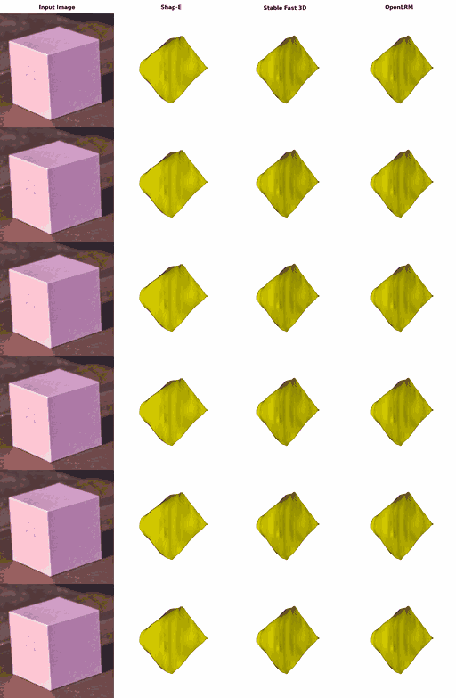

# GIQ:  Benchmarking 3D Geometric Reasoning of Vision Foundation Models with Simulated and Real Polyhedra

<a href="https://arxiv.org/pdf/2412.19920"></a>


<br>

This repository contains the official codebase for **G-IQ**, a comprehensive benchmark designed to assess the geometric reasoning capabilities of vision and vision-language foundation models on a diverse collection of polyhedra exhibiting rich geometric properties—convexity, symmetry, and varying levels of complexity.

<br>
<p align="center">
    
</p>


## Table of Contents


1. [Download Links to Renderings and Meshes](#download-links-to-renderings-and-meshes)
2. [JSON Metadata Files Describing Polyhedra and Splits](#json-metadata-files-describing-polyhedra-and-splits)
3. [Results: Monocular 3D Reconstruction](#results-monocular-3d-reconstruction)
4. [Citation](#citation)
5. [License](#license)


---

## Download Links to Renderings and Meshes

- **Rendered images** (256×256 PNGs, 20 views per shape):  
  `<dummy link to renderings archive>`

- **3D meshes** (OBJ/PLY format):  
  `<dummy link to mesh archive>`

---

## JSON Metadata Files Describing Polyhedra and Splits


### `shapes.json`

A JSON file describing each polyhedron in G-IQ:

```json
{
  "<shape_id>": {
    "group": "<group_name>",
    "sym": "<symmetry_type>",
    "name": "<polyhedron_name>"
  },
  …
}
```

- **Shape IDs**  
  - cid_x – Catalan solid number *k*  
  - jid_x – Johnson solid number *k*  
  - wid_x – Wenninger solid number *k*  

- **Groups** (one of):  
  platonic, archimedean, catalan, johnson, stellations,  
  kepler-poinsot, compounds, uniform non-convex

- **Symmetries**:  
  - `central point reflection`
  - `5-fold rotation`
  - `4-fold rotation`
  - `None` *(indicates none of the above three specific symmetries; other symmetries might still be present)*


- **Name**  
  The canonical polyhedron name (e.g., `"cube"`, `"hexahedron"`).

**Example entry**:

```json
{
  "wid_3": {
    "group": "platonic",
    "sym": "4-fold rotation",
    "name": "cube, hexahedron"
  }
}
```

### Hard Split (`hard_examples.json`)

Defines challenging "hard" pairs for the Mental Rotation Test in a structured JSON format, divided into negative and positive pairs.

**Structure**:

```json
{
  "negative": [
    ["shape_id_1", "shape_id_2"],
    ...
  ],
  "positive": [
    ["shape_id_x", "shape_id_x"],
    ...
  ]
}
```

- **Negative pairs** contain different shapes that are visually similar and difficult to differentiate.
- **Positive pairs** contain identical shapes.

**Example**:

```json
{
  "negative": [
    ["wid 89", "wid 5"],
    ["cid 7", "wid 9"]
  ],
  "positive": [
    ["wid 5", "wid 5"],
    ["cid 7", "cid 7"]
  ]
}
```


---


## Results: Monocular 3D Reconstruction

Below are representative results of monocular 3D reconstruction using state-of-the-art methods (Shap-E, Stable Fast 3D, OpenLRM):

<p align="center">
  
  <!-- Replace with actual GIF showcasing reconstruction results -->
</p>

---


## Citation
```BibTeX
@article{michalkiewicz2024not,
  title={Not all Views are Created Equal: Analyzing Viewpoint Instabilities in Vision Foundation Models},
  author={Michalkiewicz, Mateusz and Bai, Sheena and Baktashmotlagh, Mahsa and Jampani, Varun and Balakrishnan, Guha},
  journal={arXiv preprint arXiv:2412.19920},
  year={2024}
}
```
