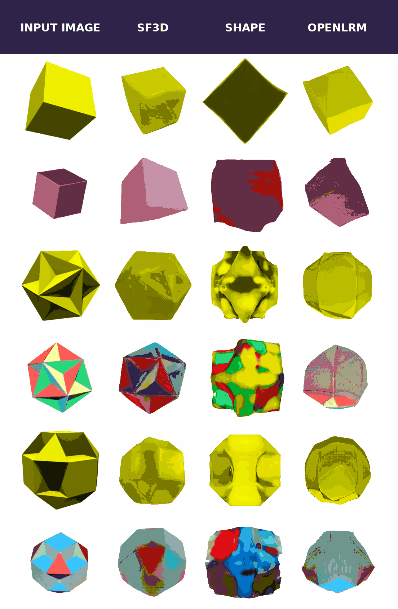

# GIQ: Benchmarking 3D Geometric Reasoning of Vision Foundation Models with Simulated and Real Polyhedra

<a href="https://arxiv.org/pdf/2412.19920"></a>

<br>

## About

Visit our website: [GIQ Project Page](https://toomanymatts.github.io/giq-project-page-test/)


This repository contains the official codebase for **G-IQ**, a comprehensive benchmark designed to assess the geometric reasoning capabilities of vision and vision-language foundation models on a diverse collection of polyhedra exhibiting rich geometric properties—convexity, symmetry, and varying levels of complexity.

<br>
<p align="center">
    
</p>


## Table of Contents

1. [Download Links to Renderings and Meshes](#download-links-to-renderings-and-meshes)
2. [JSON Metadata Files Describing Polyhedra and Splits](#json-metadata-files-describing-polyhedra-and-splits)
3. [Featurizers Used in Experiments](#featurizers-used-in-experiments)
4. [Results: Monocular 3D Reconstruction](#results-monocular-3d-reconstruction)
5. [Citation](#citation)
6. [License](#license)

---

## Download Links to Renderings and Meshes:  
- **3D meshes** (OBJ format, organized as `3d_meshes/<group>/<shape_id>.obj`):
  
  [**Download Meshes (22.8 MB)**](https://drive.google.com/file/d/1i_6up_4Cc24EaIhnKkhMboaDw-1tdJdC/view?usp=sharing)
- **Rendered images** (JPG format):
  
  [**Download Renderings (90 GB)**](https://drive.google.com/file/d/1kCXKpisGIcz7qgKpdMFqzNji7CnNIX9w/view?usp=sharing)


---

## JSON Metadata Files Describing Polyhedra and Splits

### `shapes.json`

Describes each polyhedron in G-IQ:

```json
{
  "<shape_id>": {
    "group": "<group_name>",
    "sym": "<symmetry_type>",
    "name": "<polyhedron_name>"
  },
  …
}
```

- **Shape IDs**: `cid_x`, `jid_x`, `wid_x`  
- **Groups**: `platonic`, `archimedean`, `catalan`, `johnson`, `stellations`, `kepler-poinsot`, `compounds`, `uniform non-convex`
- **Symmetries**: `central point reflection`, `5-fold rotation`, `4-fold rotation`, `None`
- **Name**: Canonical polyhedron name

**Example**:

```json
{
  "wid_3": {
    "group": "platonic",
    "sym": "4-fold rotation",
    "name": "cube, hexahedron"
  }
}
```

### Hard Split (`hard_examples.json`)

Defines challenging pairs for the Mental Rotation Test:

```json
{
  "negative": [["wid 89", "wid 5"], ["cid 7", "wid 9"]],
  "positive": [["wid 5", "wid 5"], ["cid 7", "cid 7"]]
}
```

---

## Featurizers Used in Experiments

The `featurizers/` folder contains Python classes implementing the featurizers:

- `clip_featurizer.py`
- `convnext_featurizer.py`
- `deit_iii_featurizer.py`
- `dino_featurizer.py`
- `dinov2_featurizer.py`
- `dreamsim_featurizer.py`
- `mae_featurizer.py`
- `sam_featurizer.py`
- `siglip_featurizer.py`

Each featurizer class provides methods to load the corresponding pretrained model and encode images into feature embeddings.

**Example**:

```python
from featurizers.featurizer_loader import load_featurizer

model = load_featurizer('dinov2')

img = Image.open(img_path).convert('RGB')
img_prep = model.preprocess_image(img)
emb = model.encode_image(img_prep)
```

---

## Results: Monocular 3D Reconstruction

Below are representative results of monocular 3D reconstruction using state-of-the-art methods (Shap-E, Stable Fast 3D, OpenLRM):

<p align="center">
  
  <!-- Replace with actual GIF showcasing reconstruction results -->
</p>

---

## Citation
```BibTeX
@article{michalkiewicz2024not,
  title={Not all Views are Created Equal: Analyzing Viewpoint Instabilities in Vision Foundation Models},
  author={Michalkiewicz, Mateusz and Bai, Sheena and Baktashmotlagh, Mahsa and Jampani, Varun and Balakrishnan, Guha},
  journal={arXiv preprint arXiv:2412.19920},
  year={2024}
}
