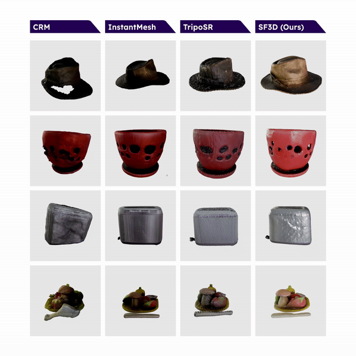
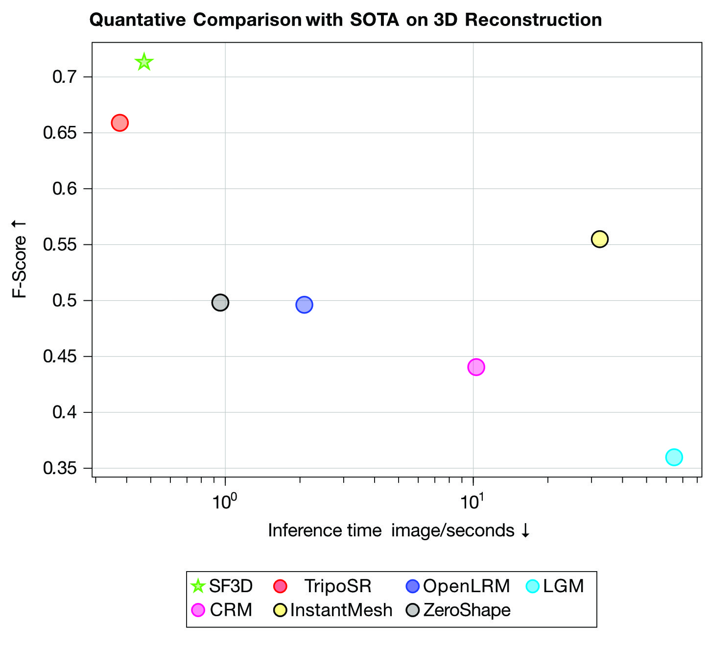

# SF3D: Stable Fast 3D Mesh Reconstruction with UV-unwrapping and Illumination Disentanglement

<a href="https://arxiv.org/abs/2408.00653"></a> <a href="https://huggingface.co/stabilityai/stable-fast-3d"></a> <a href="https://huggingface.co/spaces/stabilityai/stable-fast-3d"></a>

<div align="center">
  
</div>

<br>

This is the official codebase for **Stable Fast 3D**, a state-of-the-art open-source model for **fast** feedforward 3D mesh reconstruction from a single image.

<br>

<p align="center">
    
</p>

<p align="center">
    
</p>

Stable Fast 3D is based on [TripoSR](https://github.com/VAST-AI-Research/TripoSR) but introduces several new key techniques. For one, we explicitly optimize our model to produce good meshes without artifacts alongside textures with UV unwrapping. We also delight the color and predict material parameters so the assets can be easily integrated into a game. We achieve all of this while still maintaining the fast inference speeds of TripoSR.

## Getting Started

### Installation

Ensure your environment is:
- Python >= 3.8
- Optional: CUDA or MPS has to be available
- For Windows **(experimental)**: Visual Studio 2022
- Has PyTorch installed according to your platform: https://pytorch.org/get-started/locally/ [Make sure the Pytorch CUDA version matches your system's.]
- Update setuptools by `pip install -U setuptools==69.5.1`
- Install wheel by `pip install wheel`

Then, install the remaining requirements with `pip install -r requirements.txt`.
For the gradio demo, an additional `pip install -r requirements-demo.txt` is required.


## Citation
```BibTeX
@article{michalkiewicz2024not,
  title={Not all Views are Created Equal: Analyzing Viewpoint Instabilities in Vision Foundation Models},
  author={Michalkiewicz, Mateusz and Bai, Sheena and Baktashmotlagh, Mahsa and Jampani, Varun and Balakrishnan, Guha},
  journal={arXiv preprint arXiv:2412.19920},
  year={2024}
}
```
